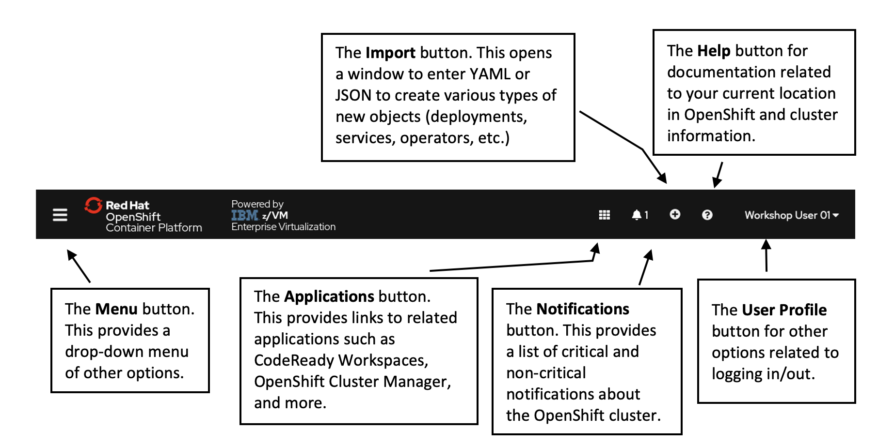
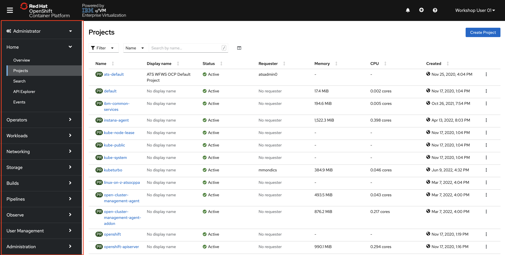
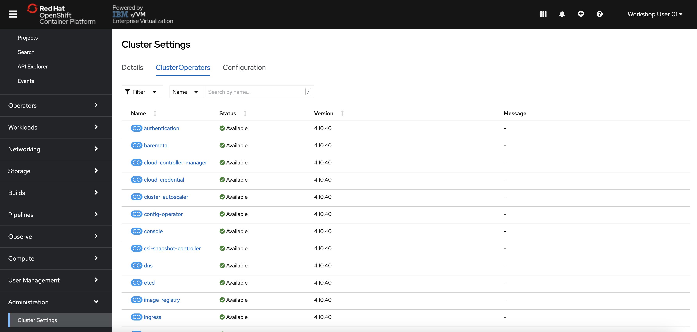
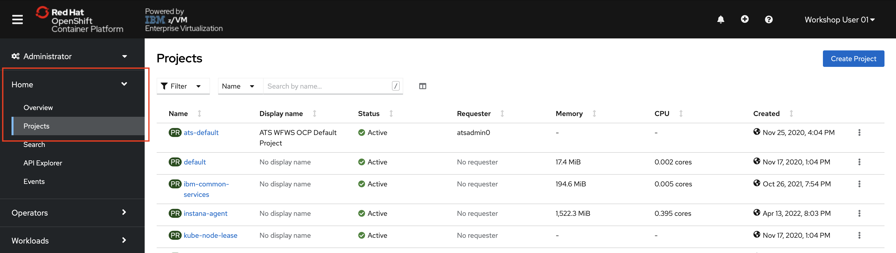
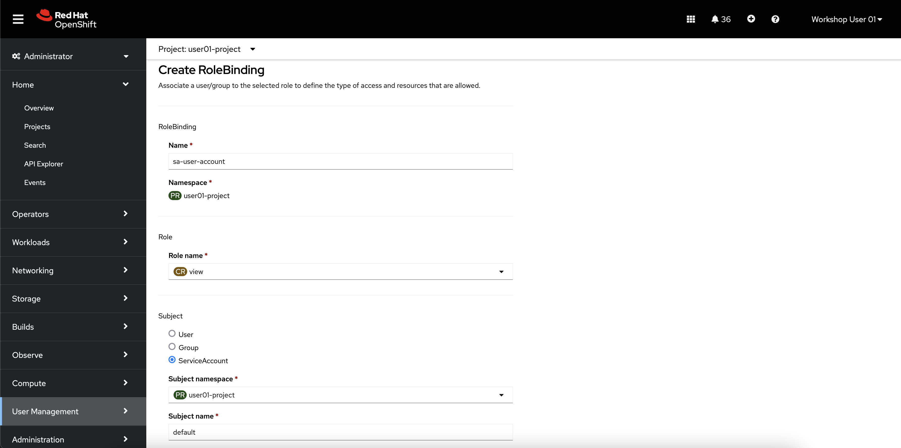

# The Administrator Perspective

Take a moment to notice the following elements in the navigation bar:

These buttons display on each page of the OpenShift console. Note that the Applications button might be missing from your screen, depending on your credentials and which applications are currently deployed on the cluster.

By default, the menu on the left side of the page should be activated and displaying the cluster menu. However, if your screen is sized too small, you may need to click the Menu button to expand it.

1. In the left-side menu, **select the Administrator perspective** if it isn't already showing.

    

    With the administrator menu showing, you are provided with a broad range of options to manage the OpenShift cluster and the applications running on it.

    

    The *Administrator* perspective is the default view for the OpenShift console for users who have an administrative access level. This perspective provides visibility into options related to cluster administration, the cluster operators running the OpenShift cluster itself, as well as a broader view of the projects associated with the currently authenticated user.

    Your user credentials have the `cluster-reader` roleBinding. This is a read-only roleBinding that allows you to *see* most of what OpenShift has to offer administrators without allowing you to modify cluster objects. For example, typical non-admin users would not be able to complete the following few steps.

2. In the menu at the very bottom, **click Administration -> Cluster Settings**.

    

    The cluster settings page is where administrators can see what OpenShift versions are available, and also update the cluster from within the console. OpenShift completely automates the cluster update once triggered by an administrator, including updating all of the cluster operators and the CoreOS operating system running on the nodes.

3. On the Cluster Settings page, **select the ClusterOperators tab**.

    

    Each clusterOperator is responsible for managing resources related to a specific OpenShift function. For example, the `authentication` clusterOperator manages all of the resources (pods, routes, secrets, etc.) related to the LDAP authentication you are using to log in with the `userNN` username.

4. In the Menu, **click Compute -> Nodes.**

    

    As you see on the *Nodes* page, the OpenShift cluster is made up of control plane nodes and compute nodes.

    - **Control Plane nodes** are responsible for most of the core Kubernetes and OpenShift services such as etcd, the Kubernetes and OpenShift apiservers, the scheduler, and more. There are all vital tasks that make it possible to run the cluster and schedule application workloads to Compute Nodes.
    - **Compute nodes** are where application containers run. The containers for the sample application that you will build and deploy later in this lab will run on the compute nodes.

    In production environments, nodes are typically run on multiple machines (physical and/or virtual) in order to be more highly available and fault-tolerant.

5. On the Nodes page, **click the hyperlink for one of the Compute nodes**.

    

    When looking at a specific node, you are provided a view similar to the OpenShift cluster overview page, but now it is scoped to display only the pods, events, metrics, etc. for the specific node of interest.

6. On the Compute Node's page, **click the Details tab**.

    

    On the node details tab, you are provided more information about the node including the architecture it is running on. In the screenshot above, the `s390x` architecture indicates that the node is running the Linux on IBM Z (`s390x`) architecture.

    One of the many benefits of OpenShift (and Kubernetes more broadly) is that they abstract away the underlying infrastructure from the end users - developers and Kubernetes administrators. It does not take any traditional or specialized skills to run containers on platforms such as IBM Z.

7. In the Menu, **click Home -> Projects.**

    

    The rest of the page is populated by projects. A project has been created for you to work in named `userNN-project` (where `NN` is your user number). If your OpenShift administrator did not create this project for you, you should be able to do so yourself with the `Create Project` button in the top right of the projects page.

    Any project starting with `openshift-` or `kube-` contain the workloads running the OpenShift platform itself.

8. **Click the userNN-project hyperlink** (where `NN` is your user number).

    *Tip: With so many Projects displayed, you can use the search bar to find yours more easily.*

    You will now see the Dashboard for your project.

    

    OpenShift automatically creates a few special [serviceAccounts](glossary.md#glossary-of-terms) in every project. The `default` serviceAccount takes responsibility for running the pods. OpenShift uses and injects this serviceAccount into every pod that launches.

    The following step creates a **RoleBinding** object for the `default` serviceAccount object. The serviceAccount communicates with the OpenShift Container Platform API to learn about pods, services, and resources within the project.

9. **Click the RoleBindings tab of your project, and then click Create Binding.**

    

10. **Fill out the form as follows.**

    - Name: `sa-user-account`
    - Role Name: `view`
    - Subject: `ServiceAccount`
    - Subject namespace: `userNN-project` where `NN` is your user number
    - Subject Name: `default`

    

    **Then click create.**

    Now, the pods you create in this project that use the `default` serviceAccount will have the proper permissions needed for the sample application.

11. **Look through the Overview tab of your project**.

    This displays information about what’s going on in your project, such as CPU and memory usage, any alerts or crashlooping pods, an inventory of all the Kubernetes resources deployed in the project, and more. You won’t see much information yet, as no workloads should be running in this project.

12. **Click the Workloads tab** to the right of YAML.

    This page displays all of the workloads in your project, so it’s empty for now.

    All objects in OpenShift can be generated using [YAML](https://yaml.org/){target="_blank" rel="noopener"} files. YAML is a human-readable language for configuration files. Most OpenShift object such as Deployments, Services, Routes, etc. can be modified by directly editing their YAML file in either the console or command line.

    Workloads are typically created by developers, so in the next section, you will swap to the developer perspective to deploy an application. You will return to the administrator perspective later in this lab.