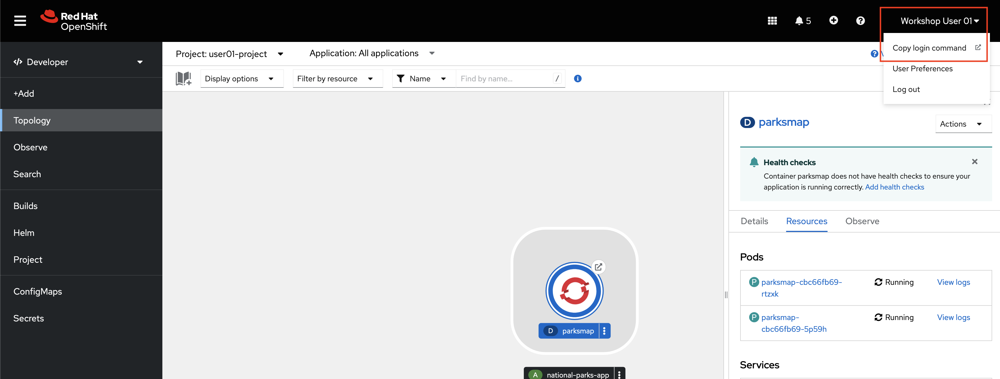
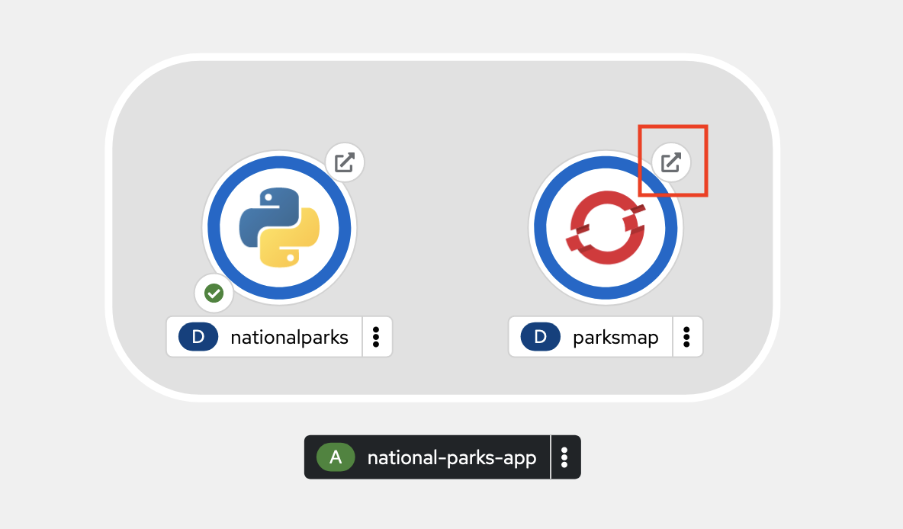

# Introduction to the `oc` CLI

The `oc` CLI is an incredibly powerful tool to manage OpenShift clusters and applications. It is capable of performing any task you can do in the web console, and some tasks are only possible to do with `oc`.

`oc` is ideal in situations where you:

- Work directly with project source code.
- Script OpenShift Container Platform operations.
- Are restricted by bandwidth resources and cannot use the web console.

Furthermore, many people familiar with Linux and/or Kubernetes tend to find the `oc` command line an easier and more efficient method of performing tasks, rather than the web-based console.

Like with the OpenShift web console, the OpenShift command line includes functions both [for developers](https://docs.openshift.com/container-platform/4.16/cli_reference/openshift_cli/developer-cli-commands.html){target="_blank" rel="noopener"} and for [administrators](https://docs.openshift.com/container-platform/4.16/cli_reference/openshift_cli/administrator-cli-commands.html){target="_blank" rel="noopener"}.

For those who are familiar with Kubernetes and its `kubectl` CLI tool, the `oc` tool is essentially analogous but with additional features.

## Logging in with the `oc` CLI

The frontend application, `parksmap`, needs a backend. In this section, you will deploy a python application named `nationalparks`. This application performs 2D geo-spatial queries against a MongoDB database to locate and return map coordinates of all national parks in North America.

**NOTE for those in the WSC hands-on lab session, you must complete the following steps from within the WSC linux guest. Refer to the [access.md](access.md#connecting-to-openshift-via-the-cli) page. If you try to connect directly from the RHEL virtual machine terminal, the command will result in an error.**

1. From the OpenShift web console, **click your username in the top right corner** (i.e. `Workshop User NN`) and select `Copy login command`.

    

2. **Log in with your OpenShift credentials and click the Display Token hyperlink**.

NOTE if the copied command fails, try adding the following flag to the end of the `oc login command`:

```text
--insecure-skip-tls-verify
```

3. **Copy the line that begins with `oc login`, paste it into a terminal session, and execute the command**.

    Sample output: 

    ```
    $ oc login --token=uL3fHEPSGH3io0kljsgRfAMAPIIY44BhwnGxCMA3dei4 --server=https://api.example.com:6443
    Logged into "https://api.example.com:6443" as "user01" using the token provided.

    You have access to 161 projects, the list has been suppressed. You can list all projects with 'oc projects'

    Using project "user01-project".
    ```

    You are now logged into the cluster via the `oc` CLI, and you are told which project you are using.

    If you’re in a project other than your own `userNN-project`, use the following command to move into it: `oc project userNN-project`, where `NN` is your user number.

## Exploring the `oc` CLI

1. **In your terminal, test out the `oc` CLI**.

    ```text
    oc --help
    ```

    Sample output: 

    ```
    user01@lab061:~$ oc --help
    OpenShift Client

    This client helps you develop, build, deploy, and run your applications on any
    OpenShift or Kubernetes cluster. It also includes the administrative
    commands for managing a cluster under the 'adm' subcommand.

    Usage:
    oc [flags]

    Basic Commands:
    login           Log in to a server
    new-project     Request a new project
    new-app         Create a new application
    status          Show an overview of the current project
    project         Switch to another project
    projects        Display existing projects
    explain         Documentation of resources

    Build and Deploy Commands:
    rollout         Manage a Kubernetes deployment or OpenShift deployment config
    rollback        Revert part of an application back to a previous deployment
    new-build       Create a new build configuration
    start-build     Start a new build
    ```

    The `--help` flag will display all of the available options the oc CLI.

2. **Enter the following command**

    ```text
    oc new-app --help
    ```

    Sample output:

    ```
    user01@lab061:~$ oc new-app --help
    Create a new application by specifying source code, templates, and/or images

    This command will try to build up the components of an application using images, templates, or code
    that has a public repository. It will lookup the images on the local Docker installation (if
    available), a container image registry, an integrated image stream, or stored templates.

    If you specify a source code URL, it will set up a build that takes your source code and converts
    it into an image that can run inside of a pod. Local source must be in a git repository that has a
    remote repository that the server can see. The images will be deployed via a deployment
    configuration, and a service will be connected to the first public port of the app. You may either
    specify components using the various existing flags or let new-app autodetect what kind of
    components you have provided.

    If you provide source code, a new build will be automatically triggered. You can use 'oc status' to
    check the progress.

    Usage:
    oc new-app (IMAGE | IMAGESTREAM | TEMPLATE | PATH | URL ...) [flags]

    Examples:
    # List all local templates and image streams that can be used to create an app
    oc new-app --list
    
    # Create an application based on the source code in the current git repository (with a public
    remote) and a Docker image
    oc new-app . --docker-image=repo/langimage
    ```

    The `--help` flag now displays all of the available options for the oc new-app command. If you get confused about any of the commands we use in this workshop, or just want more information, using this flag is a good first step.

`oc new-app` is a powerful and commonly used command in the OpenShift CLI. It has the ability to deploy applications from components that include:

- Source or binary code
- Container images
- Templates

The set of objects created by `oc new-app` depends on the artifacts passed as an input.

## Use `oc` to Deploy a Python Application from Source Code

The frontend application, `parksmap`, needs a backend. In this section, you will deploy a python application named `nationalparks`. This application performs 2D geo-spatial queries against a MongoDB database to locate and return map coordinates of all national parks in North America.

1. **Deploy the python backend with the following `oc new-app` command**.

    ```text
    oc new-app python~https://github.com/mmondics/national-parks --context-dir source/nationalparks-py --name nationalparks -l 'app=national-parks-app,component=nationalparks,role=backend,app.kubernetes.io/part-of=national-parks-app,app.kubernetes.io/name=python'
    ```

    A few things to notice about this command:

    - The `oc new-app` command is not being run against a specific container image. It is being run against python *source code* that exists in GitHub [here](https://github.com/mmondics/national-parks/tree/main/source/nationalparks-py){target="_blank" rel="noopener"}. Although a Dockerfile exists in the directory, it is not being used due to the `pyhon~` option in the command. OpenShift is using its *source-to-image* capability to create its own Dockerfile and containerize the application from its source code. If you wanted to, you could have omitted the `python~` option and OpenShift would use the Dockerfile in the directory.
    - `--name` flag provides the name for the python Deployment
    - `-l` sets the following key=value pairs as labels on the deployment

    The output from the `oc new-app` command tells you what all was created - an imagestream, buildconfig, deployment, and service. 

    The buildconfig is the configuration file that will be used to build the `nationalparks` container image. This build will automatically begin, and you can check its logs to watch the process. 

2. **Check the `nationalparks` build log**.
   
    ```text
    oc logs build/nationalparks-1 -f
    ```

    The `-f` flag lets you follow the build logs (similar to Linux's 'tail' command). Once you see `Push successful` at the end of the build logs, your new container image has been built and pushed into OpenShift's internal registry. It will then automatically be deployed in a pod.

3. **Check that the `nationalparks` pod is running and ready**.

    ```text
    oc get pods
    ```

    Sample output:

    ```text
    ➜  ~ oc get pods
    NAME                             READY   STATUS      RESTARTS   AGE
    nationalparks-1-build            0/1     Completed   0          5m19s
    nationalparks-64d57bb8f8-4582b   1/1     Running     0          4m6s
    parksmap-cbc66fb69-d29rn         1/1     Running     0          3m25s
    parksmap-cbc66fb69-dmnf7         1/1     Running     0          3m24s
    ```

    Once the `nationalparks` pod is `Running` and has `1/1` containers ready, the application is successfully deployed. However, the backend python application is only accessible from within the OCP cluster. It is not exposed to the outside world, as you may have noticed from the output of the `oc new-app` command: `Application is not exposed. You can expose services to the outside world by executing one or more of the commands below:`

4. **Create a route that exposes the `nationalparks` service**.

    ```text
    oc expose service/nationalparks
    ```

    It's worth understanding a little bit about what you just did. The backend application `nationalparks` runs in one pod. However, you could easily scale the number of pods running `nationalparks` up as much as you'd like, or you can let OpenShift automatically scale out the number of pods (based on CPU or memory consumption) with a [HorizontalPodAutoscaler](https://kubernetes.io/docs/tasks/run-application/horizontal-pod-autoscale/){target="_blank" rel="noopener"}. Each pod will be assigned its own individual IP address, and furthermore, if and when the pods regenerate, they will get brand new IP addresses. For these reasons, you cannot rely on the application's IP address in order to use it, like you would with many non-containerized applications. 

    To solve this problem, Kubernetes uses *services*. [Services](https://kubernetes.io/docs/concepts/services-networking/service/){target="_blank" rel="noopener"} are load balancers internal to the cluster that distribute requests among the application pods using label matching. If you want to access an application, you need to access the service that will then direct the request to one of the pods.

    However, services are **internal** to the cluster. They allow pods to communicate with other pods inside the cluster, but not with the outside world. For external access, we need to introduce another object - **routes**. 

    [Routes](https://docs.openshift.com/container-platform/4.16/rest_api/network_apis/route-route-openshift-io-v1.html){target="_blank" rel="noopener"} are OpenShift objects - they do not exist in upstream Kubernetes. Routes *expose* services as publicly-accessible addresses for users and applications to interact with. When you access an OpenShift appliction in a web browser, such as the `parksmap` webpage or even the OpenShift console, you navigate to that pod's route.

    

5. **See the new route that was created**.

    ```text
    oc get route
    ```

    Sample output:

    ```text
    ➜  ~ oc get routes
    NAME            HOST/PORT                                        PATH   SERVICES        PORT       TERMINATION     WILDCARD
    nationalparks   nationalparks-user01-project.apps.example.com          nationalparks   8080-tcp                   None
    parksmap        parksmap-user01-project.apps.example.com               parksmap        8080-tcp   edge/Redirect   None
    ```

6. **Label the `nationalparks` route as the application backend**.

    ```text
    oc label route nationalparks type=parksmap-backend
    ```

7. **Navigate to the frontend `parksmap` route in a web browser**. Use the `parksmap` `HOST/PORT` value from the `oc get routes` command preceded by `http://`.

    For example: `http://parksmap-userNN-project.apps.example.com`

    Alternatively, you can click the small arrow button associated with the `parksmap` deployment in the OpenShift web console topology.

    

    Any way that you get there, your application should display the image below:

    

    You should see a map of the world, but you will not see any icons for National Parks yet. That's because we have one more application to deploy and configure - the MongoDB database that will store all of the data about National Parks and their locations.

## Deploying and Configuring MongoDB

The MongoDB you will deploy in this section will store all information about the National Parks, their names and coordinates.

1. **Deploy the MongoDB container**.

    ```text
    oc new-app quay.io/mmondics/mongodb:latest --name mongodb-nationalparks -e MONGODB_USER=mongodb -e MONGODB_PASSWORD=mongodb -e MONGODB_DATABASE=mongodb -e MONGODB_ADMIN_PASSWORD=mongodb -l 'app.kubernetes.io/part-of=national-parks-app,app.kubernetes.io/name=mongodb'
    ```

    A few things to notice about this command:

    - You're deploying a pre-built container image hosted at <quay.io/mmondics/mongodb>. 
    - `--name` sets the name of the MongoDB deployment
    - `-e` sets environment variables within the resulting container. These can be used like any other environment variable when the container is running, and you can see them by connecting to the pod and running the `env` command
    - `-l` sets labels for this deployment

2. In a later step, you will be adding persistent storage to this MongoDB deployment. Mounting storage requires a certain securityContext, so in preparation, **please run the following command to add the proper securityContext**.

    ```text
    oc patch deployment mongodb-nationalparks --type='json' -p='[{"op":"add","path":"/spec/template/spec/securityContext","value":{"fsGroup":184,"runAsGroup":184,"runAsUser":184}}]'
    ```

    Once again, you can check `oc get pods` to see when the MongoDB pod is ready.

    ```text
    NAME                                     READY   STATUS      RESTARTS   AGE
    mongodb-nationalparks-5d8b6f99f7-4wwst   1/1     Running     0          8s
    nationalparks-1-build                    0/1     Completed   0          58m
    nationalparks-67b69fc9b7-z5znq           1/1     Running     0          56m
    parksmap-cbc66fb69-c87k7                 1/1     Running     0          39m
    ```

    Now, you may think that you are ready to look at your frontend application again to see the backend data. However, this MongoDB requires authentication before it can be used, so in the next section, you will provide sensitive information to the application using OpenShift *secrets*.

## Providing Sensitive Application with Secrets

The *Secret* object provides a mechanism to hold sensitive information such as passwords, OpenShift Container Platform client configuration files, private source repository credentials, and so on. Secrets decouple sensitive content from the pods. You can mount secrets into containers using a volume plugin or the system can use secrets to perform actions on behalf of a pod. By default, secrets are stored *unencrypted* in etcd. Therefore secrets are securable by default, not secured. To safely secure secrets, you must turn on etcd encryption as well as configure proper role-based access controls to the secret objects and etcd. Read more about secrets [here](https://kubernetes.io/docs/concepts/configuration/secret/).

The following procedure adds the secret `nationalparks-mongodb-parameters` and mounts it to the `nationalparks` workload.

1. **Create a secret holding sensitive information** (usernames and passwords).

    ```text
    oc create secret generic nationalparks-mongodb-parameters --from-literal=DATABASE_SERVICE_NAME=mongodb-nationalparks --from-literal=MONGODB_USER=mongodb --from-literal=MONGODB_PASSWORD=mongodb --from-literal=MONGODB_DATABASE=mongodb --from-literal=MONGODB_ADMIN_PASSWORD=mongodb
    ```

2. **Update the environment variable to attach the `nationalparks-mongodb-parameters` secret to the `nationalparks` workload**.

    ```text
    oc set env --from=secret/nationalparks-mongodb-parameters deploy/nationalparks
    ```

    The `nationalparks` deployment will notice that a change has been made, and it will create a new pod with these changes applied. Check with `oc get pods` until the new pod is up and running.

3. Once the `mongodb-nationalparks` pod is running and ready, **run the following command to load National Park data into MongoDB**.

    **Make sure that you are in your own project before running the command.**

    ```text
    oc exec $(oc get pods -l component=nationalparks | tail -n 1 | awk '{print $1;}') -- curl -s http://localhost:8080/ws/data/load
    ```

    If you see `"Items inserted in database: 204"`, the data was successfully loaded.

4. Finally, **return to your frontend `parksmap` application in a web browser**.

    

This interactive map is the culmination of all the Kubernetes and OpenShift objects that you created throughout the course of this tutorial. You can click on each icon on the map to see more details about each National Park.