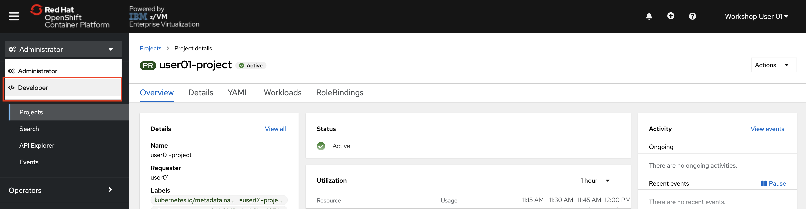
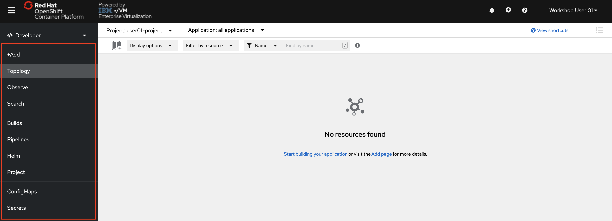
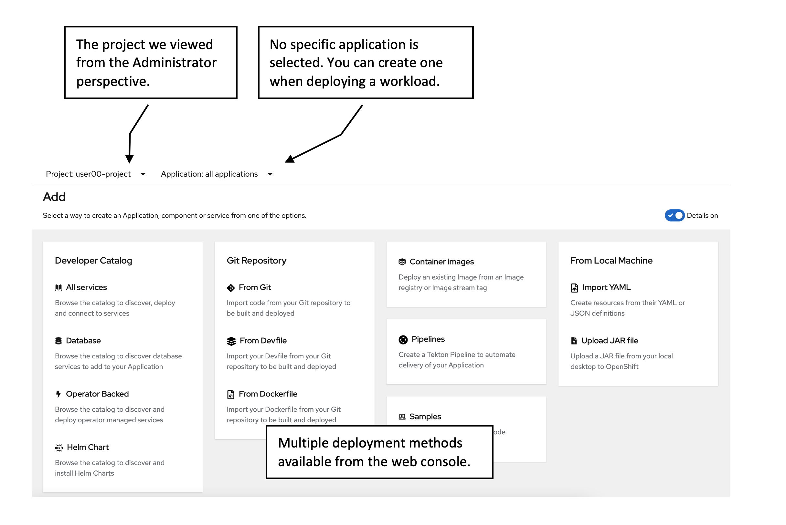
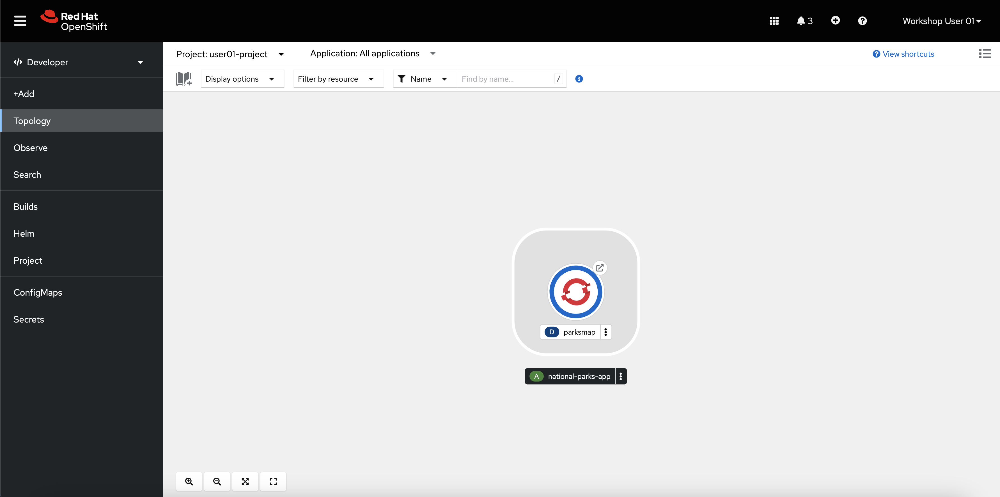
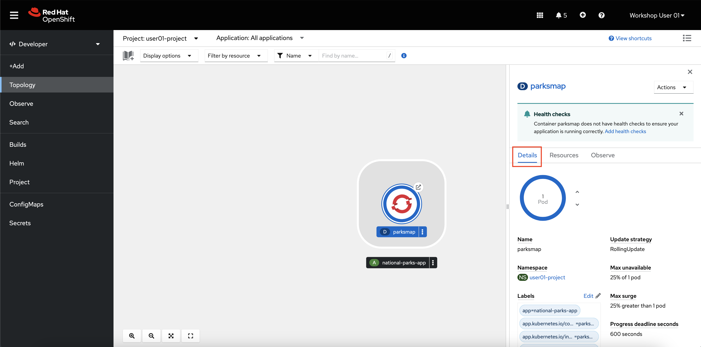
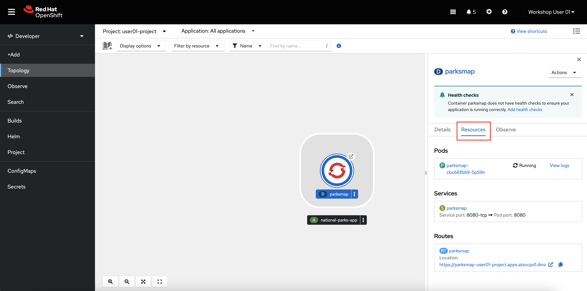
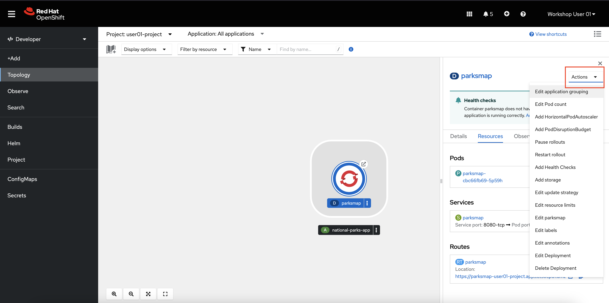
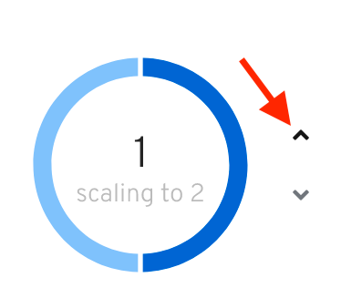
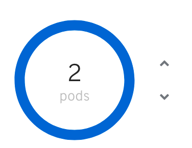

# The Developer Perspective

1. In the left-side Menu, **click the Administrator dropdown, and select Developer**.

    

    The *Developer* perspective provides views and workflows specific to developer use cases, while hiding many of the cluster management options typically used by administrators. This perspective provides developers with a streamlined view of the options they typically use.

    

Switching to the Developer perspective should take you to the *Topology* view. If this isn't the case, select the *Topology* item in the left-side menu. If no workloads are deployed in the selected project, options to start building an application or visit the +Add page or are displayed.

2.  **Click the +Add button in the menu**.

    

    There are multiple methods of deploying workloads from the OpenShift web browser, including from raw source code hosted in a Git repository, from a pre-built container image, or from an operator.

## Deploying a Container Image

The simplest way to deploy an application in OpenShift Container Platform is to run an existing container image. The following procedure deploys a front end component of an application called `national-parks-app`. This frontend web application displays an interactive map which shows the location of national parks across North America.

3. From the +Add view in the Developer perspective, **click Container images**.

4. **Enter the following values**:

    - Image name from external registry: `quay.io/mmondics/national-parks-frontend:latest`
    - Application name: `national-parks-app`
    - Name: `parksmap`

    Keep the default target port as well as the route option checked.

    In the Advanced Options section, click Labels and add labels to better identify this deployment later. Labels help identify and filter components in the web console and in the command line. Add the following labels:

    - `app=national-parks-app`
    - `component=parksmap`
    - `role=frontend`

    Note: you can hit the `enter` or `tab` key to enter each individual label.

5. **Click Create**.

    You are redirected to the Topology page where you will shortly see the `parksmap` deployment in the `national-parks-app` application.

    

## Examining the Pod

The topology page gives you a visual representation of your application where you can view and monitor its components.

1. **Click the circular icon for your `parksmap` deployment**.

    This brings up a window on the right side of the screen with more options for the deployment.
    
2. **Click the details tab, if not already on it**. 
 
    

   Here you can manage its properties including number of copies, labels, or storage.

3. **Click the Resources tab**. 

    

    Here you can access the pod or its logs as well as the route where the application is accessible.

4. **Click the Actions dropdown menu**.

    

    This menu provides many options for how to manage or modify your `parksmap` deployment. Most of these options can be set either at the time you deploy the application, or afterwards as in this case.

## Scaling the Frontend Application

In Kubernetes, a Deployment object defines how an application deploys. In most cases, users use Pod, Service, ReplicaSets, and Deployment resources together. As in the previous section, OpenShift Container Platform creates each of these dependent resources for you, rather than you having to configure each one manually.

When you deployed the `national-parks-frontend` image, a deployment resource was created with only one pod deployed. However, in most cases, users will want to scale their application to have multiple copies running at the same time. This is one of the core features of Kubernetes and OpenShift that build a more highly available application by creating multiple copies of it across different physical or virtual hosts.

1. On the details tab for the `parksmap` deployment, **click the up arrow next to the blue circle that says `1 pod`**. 

    

    This scales your application from one pod to two pods.

    

    This is a simple demonstration of horizontal scaling with Kubernetes. You now have two instances of your pod running in the OpenShift cluster. Traffic to the `parksmap` application will now be distributed to each pod, and if for some reason a pod is lost, that traffic will be redistributed to the remaining pods until Kubernetes starts another. If a whole compute node is lost, Kubernetes will move the pods to different compute nodes.

    OpenShift and Kubernetes also support [horizontal autoscaling](https://docs.openshift.com/container-platform/4.16/nodes/pods/nodes-pods-autoscaling.html){target="_blank" rel="noopener"} of pods based on CPU or memory consumption, but that is outside the scope of this lab.

Now that you are more familiar with the OpenShift web console, the next section will introduce you to the OpenShift command line interface (CLI) `oc`. You will use the `oc` CLI to deploy a backend python application to serve data to the frontend `parksmap` as well as to deploy a containerized MongoDB application.