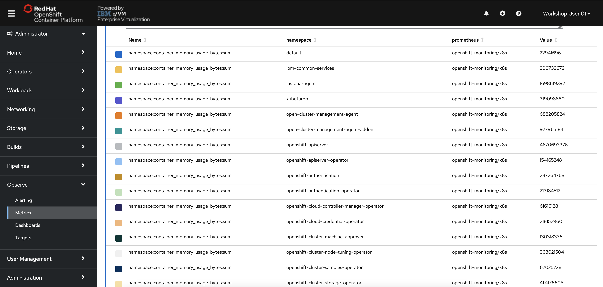
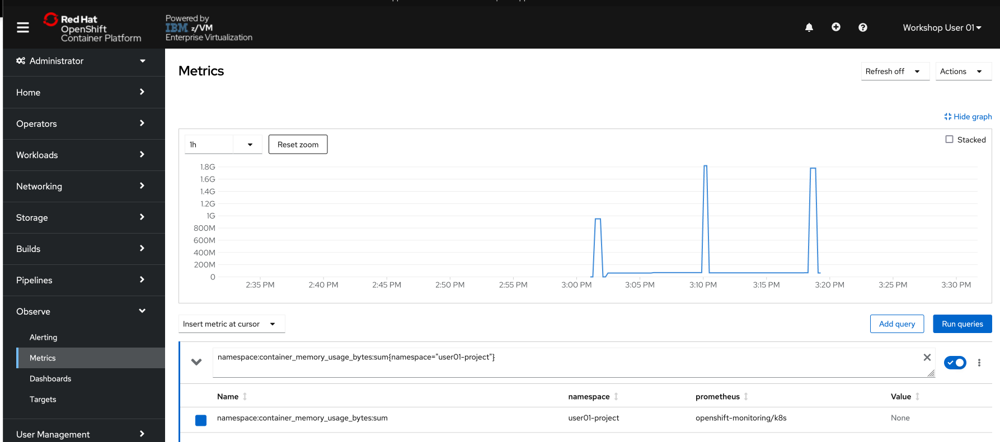

# Metering, Monitoring, and Alerts

A significant architectural shift toward containers is underway and, as with any architectural shift, this brings new operational challenges. It can be challenging for many of the legacy monitoring tools to monitor container platforms in fast moving, often ephemeral environments. The good news is newer cloud-based offerings can ensure monitoring solutions are as scalable as the services being built and monitored. These new solutions have evolved to address the growing need to monitor your stack from the bottom to the top.

From an operations point of view, infrastructure monitoring tools collect metrics about the host or container, such as CPU load, available memory and network I/O.

The default monitoring stack is the 3-pronged open source approach of, Grafana, Alertmanager, and Prometheus.

**Prometheus** gives you finely grained metrics at a huge scale. With the right configuration, Prometheus can handle millions of time series.

**Grafana** can visualize the data being scraped by Prometheus. Grafana comes with pre-built dashboards for typical use cases, or you can create your own custom ones.

**Alertmanager** forwards alerts to a service such as Slack or another webhook . Alertmanager can use metadata to classify alerts into groups such as errors, notifications, etc.

The Grafana-Alertmanager-Prometheus monitoring stack provides a highly configurable, open source option to monitor Kubernetes workloads.


## OpenShift Metrics (Prometheus)

OpenShift provides a web interface to *Prometheus*, which enables you to run Prometheus Query Language (PromQL) queries and visualize the metrics on a plot. This functionality provides an extensive overview of the cluster state and helps to troubleshoot problems.

1. In the OpenShift console, **switch to the Administrator perspective** if you are not already on it.

    

2. In the menu bar on the left side of the page, **click Observe and then Metrics**.

    

    You will be taken to a Prometheus interface within the OpenShift console.

    

    Once you enter a query, the graph will populate.

3. **Enter the following string in the query bar**:

    ```text
    namespace:container_memory_usage_bytes:sum
    ```

4. **Hit your enter key or click the associated query result that is returned**.

    The string will populate the query text box.

5. **If the graph and table are not automatically populated. click the blue "Run Queries" button**.

    The graph should now display the memory usage over time for each namespace.

    

6. **Scroll down the page** to the table displaying each namespace and its memory usage in bytes.

    

    Your table will look different depending on what work is being done in the OpenShift cluster at the time.
    
    Notice that you have *observability* of the entire OpenShift cluster, even though you cannot access or edit projects other than your own. In other words, you have read-only access to the full OpenShift cluster via the Observability stack, but you read-write access within your userNN-project.

    OpenShift passes around a massive amount of data to run itself and the applications running on top of it. Prometheus is an extremely powerful data source that can return results for millions of time strings with extremely granular precision.

    Because of OpenShift’s vast data production and Prometheus’ ability to process it, certain queries can produce simply too much data to be useful. Because Prometheus makes use of labels, we can use these labels to filter data to make better sense of it.

7. **Modify your query to the following**:

    ```text
    namespace:container_memory_usage_bytes:sum{namespace="userNN-project"}
    ```

    Make sure you change the one instance of `NN` to your user number.

    Also, notice that they are squiggly brackets `{}` in the query, not regular parentheses.

8. **Click Run Queries**

    

    Your graph is now displaying the memory usage over time for your own project. If you see a “No datapoints found” message, select a longer timeframe using the dropdown menu in the top left of the graph.

    If you skipped ahead to this lab without completing the others, it’s possible that your project has not had workload deployed in it for more than the maximum time frame. If this is the case, run a simple application in your project, and you will see the data start to populate.

As you might have noticed, working directly with Prometheus can be tedious and requires specific PromQL queries that aren’t the easiest to work with. That’s why people typically use Prometheus for its *data source* functionality, and then move to Grafana for the *data visualization*.

## OpenShift Monitoring (Grafana)

1. **From the OpenShift menu, navigate to Observability -> Dashboards**.

    

    This takes you to an in-browser user interface for the Grafana monitoring solution. By default, there are various preconfigured dashboards for common use cases.

    

2. **Click the "Dashboard" dropdown in the top-left of the page, and select `Kubernetes / Compute Resources / Cluster`**.

    

    You will see a dashboard populated with information related to the cluster’s compute resources such as CPU and memory utilization. This dashboard displays CPU usage and CPU quota/memory requests by namespace.

3. **Scroll down the page and look through the various CPU/memory/networking metrics.**

    Notice that each chart has an `Inspect` option. Clicking it will take you to the relevant Metrics page with the proper Prometheus query applied for more fine-grained detail.

For users who are familiar with the standard Grafana interface, that can also be accessed outside of the OpenShift console (rather than these pages integrated into the console).

You can find the direct link to the Grafana webpages by looking at the routes (Adminstrator -> Networking -> Routes) in the `openshift-monitoring` project.

## OpenShift Alerting (AlertManager)

Alerting with Prometheus is separated into two parts. Alerting rules in *Prometheus* send alerts to *Alertmanager*. Alertmanager then manages those alerts, including silencing, inhibition, aggregation and sending out notifications via methods such as email or chat platforms like Slack.


An example rules file with an alert would be:

```yaml
groups:
- name: example
  rules:
  - alert: HighRequestLatency
    expr: job:request_latency_seconds:mean5m{job="myjob"} > 0.5
    for: 10m
    labels:
      severity: page
    annotations:
      summary: High request latency
```

The optional `for` clause causes Prometheus to wait for a certain duration between first encountering a new expression output vector element and counting an alert as firing for this element. In this case, Prometheus will check that the alert continues to be active during each evaluation for 10 minutes before firing the alert. Elements that are active, but not firing yet, are in the pending state.

The `labels` clause allows specifying a set of additional labels to be attached to the alert. Any existing conflicting labels will be overwritten.

The `annotations` clause specifies a set of informational labels that can be used to store longer additional information such as alert descriptions or runbook links.

1. In the menu bar on the left side of the OpenShift console, **click Observe and then Alerting**.

    You will be taken to an Alertmanager interface within the OpenShift console.

    

2. **Click the Alerting Rules tab** to see the 100+ alerts that are not currently firing (hopefully!)

    

    These alerts come pre-built with the monitoring stack, and they will start firing if triggered. This list includes alerts for critical operators going down, pods crash-looping, nodes being unreachable, and many more. Feel free to look through them.

These alerts are typically sent to an external tool where relevant administrators, developers, or site-reliability engineers will be notified that they are firing. 

You cannot see and forwarded alerts for this OpenShift, but as an example, see the image below of a Slack alert generated by OpenShift alerting.

