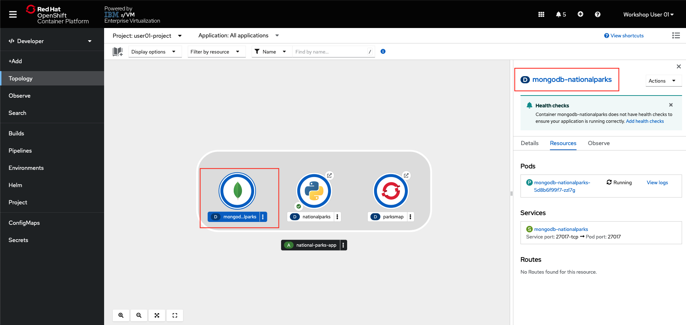
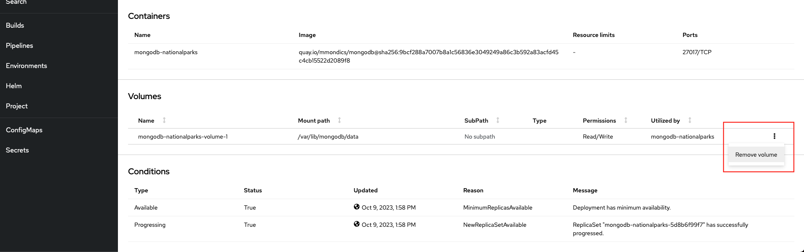
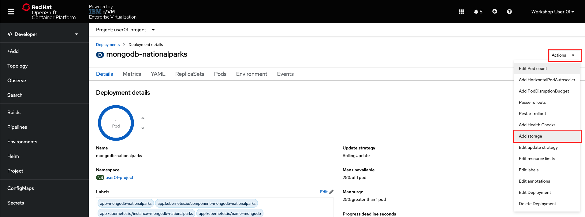
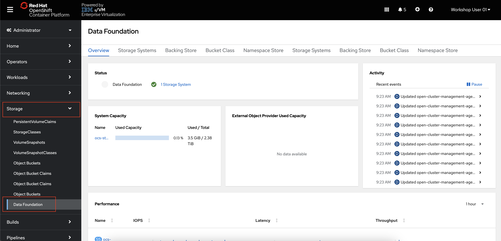
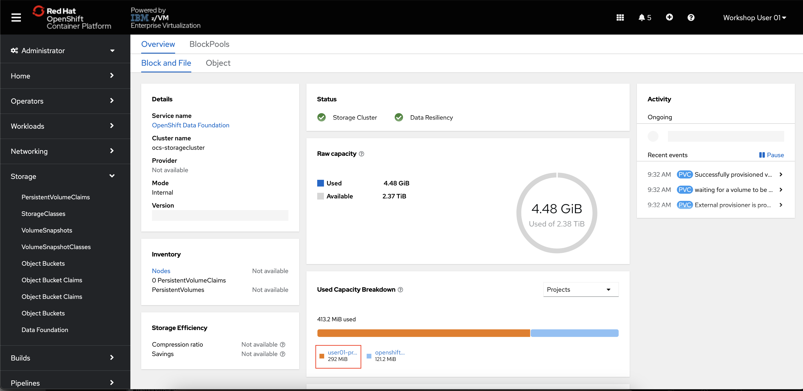

# Persistent Storage with OpenShift Data Foundation (ODF)

 **Red Hat OpenShift Data Foundation** is software-defined storage that is optimized for container environments. It runs as an operator on OpenShift Container Platform to provide highly integrated and simplified persistent storage management for containers.

Red Hat OpenShift Data Foundation is integrated into the latest Red Hat OpenShift Container Platform to address platform services, application portability, and persistence challenges. It provides a highly scalable backend for the next generation of cloud-native applications, built on a technology stack that includes Red Hat Ceph Storage, the Rook.io Operator, and NooBaa’s Multicloud Object Gateway technology. OpenShift Data Foundation also supports Logical Volume Manager Storage for single node OpenShift clusters.

Red Hat OpenShift Data Foundation provides a trusted, enterprise-grade application development environment that simplifies and enhances the user experience across the application lifecycle in a number of ways:

- Provides block storage for databases.
- Shared file storage for continuous integration, messaging, and data aggregation.
- Object storage for cloud-first development, archival, backup, and media storage.
- Scale applications and data exponentially.
- Attach and detach persistent data volumes at an accelerated rate.
- Stretch clusters across multiple data-centers or availability zones.
- Establish a comprehensive application container registry.
- Support the next generation of OpenShift workloads such as Data Analytics, Artificial Intelligence, Machine Learning, Deep Learning, and Internet of Things (IoT). 

In this lab, you will use ODF to store the National Park locations that are inside the MongoDB database pod. By making this database *persistent*, the data will continue to exist even if the MongoDB pod restarts, is moved to another node, or otherwise experiences an outage. 

## Adding Persistence to the Mongo Database

1. **In the Administrator perspective of the OpenShift console, navigate to Storage -> PersistentVolumeClaims and click the Create PersistentVolumeClaim button.**

2.  **Fill out the form as follows:**
    
    - StorageClass: `ocs-storagecluster-cephfs`
    - PersistentVolumeClaim name: `pvc-userNN` (where `NN` is your user number)
    - Access mode: `Shared access (RWX)`
    - Size: `500 MiB`
    - Volume Mode: `Filesystem`

    **and click Create.**

    You now have a claim of 500MB out of the pool of filesystem storage provided by OpenShift Data Foundation.

    Before adding a persistent volume to the database pod, we must first remove the ephemeral volume that currently exists.

3.  **From the OpenShift developer topology page, click the icon for the MongoDB application, then the link for the deployment.**

    

4.  **Scroll down to the Volumes section, and remove the single volume named `mongodb-nationalparks-volume-1`**

    

5.  **Scroll back to top of the MongoDB deployment page, click the Actions dropdown, and select Add Storage.**

    

6.  Fill the form as follows:
    
    - Storage type: `PersistentVolumeClaim`
    - PersistentVolumeClaim: `Use existing claim` -> `pvc-userNN`
    - Device Path: `/var/lib/mongodb/data`

    **and click Save**.

    Your MongoDB database is now persistent and the data will continue to exist after the pod restarts or is moved.

7. **Load the MongoDB database again**. The data was deleted when you removed the existing volume.

    ```text
    oc exec $(oc get pods -l component=nationalparks | tail -n 1 | awk '{print $1;}') -- curl -s http://localhost:8080/ws/data/load
    ```

8. **Delete your MongoDB pod so that it recycles. You can do so either via the OpenShift console, or by entering the following command in the `oc` CLI:**

    ```
    oc delete po -l deployment=mongodb-nationalparks
    ```

9. Once the pod is back up and running, **refresh the webpage for your National Parks application and see that all of the icons and locations of parks have persisted through the pod restart.**

## Exploring the OpenShift Data Foundation Console

1. **In the OpenShift Administrator perspective, navigate to Storage -> Data Foundation.**

    

    This is the main page for OpenShift Data Foundation where you can see the status of your storage system, its capacity, performance, and more.

2. Navigate to the `Storage Systems` tab, and then click the `ocs-storagecluster-storagesystem` hyperlink.

    On the Block and File tab, you can see information about the capacity and performance of block and file storage. You should also see your `userNN-project` listed as a storage consumer under *Used Capacity Breakdown*. 

    

OpenShift Data Foundation is a powerful software-defined storage solution for storage administrators who need visibility into the consumption and performance of storage in an OpenShift environment. 
