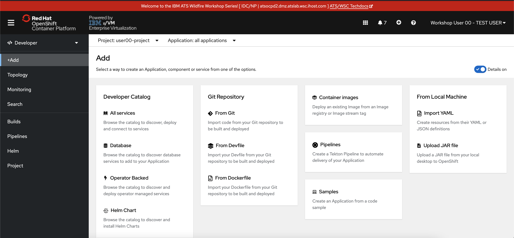
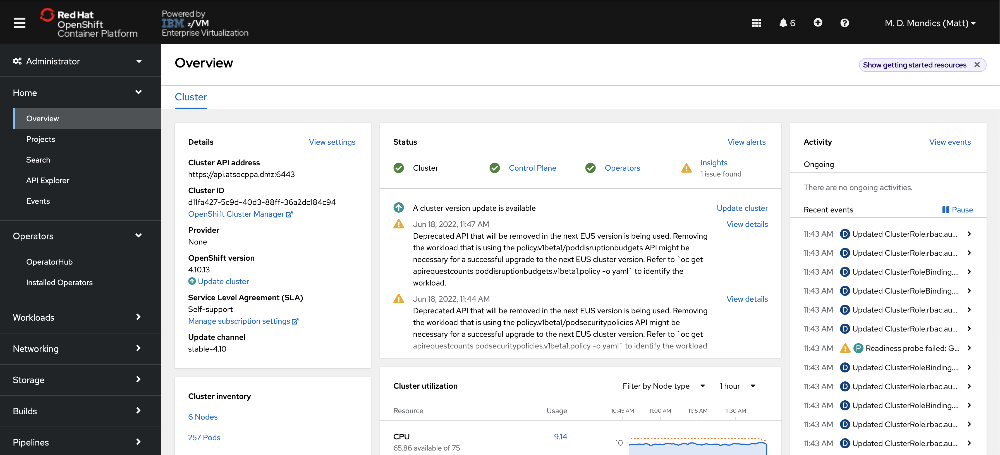
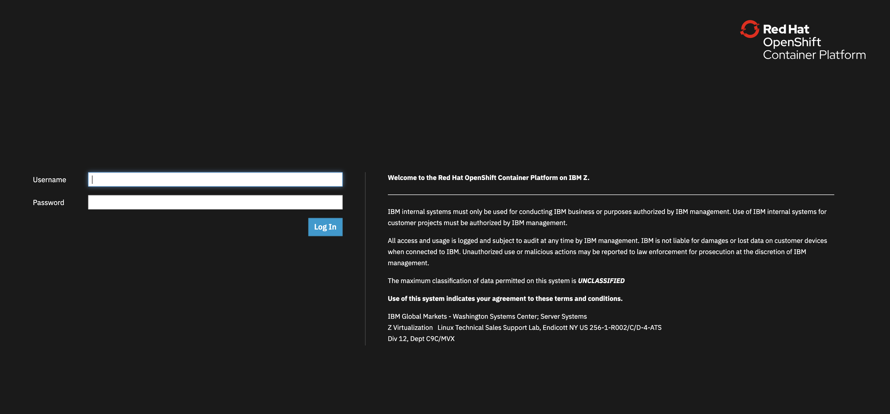

# OpenShift Overview

[OpenShift Container Platform](https://www.redhat.com/en/technologies/cloud-computing/openshift/container-platform){target="_blank" rel="noopener"} is an enterprise-grade container platform based on [Kubernetes](https://kubernetes.io/){target="_blank" rel="noopener"}. OpenShift is designed to allow applications and the data centers that support them to expand from just a few machines and applications to thousands of machines that serve millions of clients.

With its foundation in Kubernetes, OpenShift Container Platform incorporates the same technology that serves as the engine for massive telecommunications, streaming video, gaming, banking, and other applications. Its implementation in open Red Hat technologies lets you extend your containerized applications beyond a single cloud to on-premises and multi-cloud environments.

**OpenShift Container Platform**, commonly referred to as OpenShift or OCP, is a Kubernetes environment for managing the lifecycle of container-based applications and their dependencies on various computing platforms, such as bare metal, virtualized, on-premises, and in cloud. OpenShift deploys, configures and manages containers. OpenShift offers usability, stability, and customization of its components.

OpenShift utilizes a number of computing resources, known as [nodes](glossary.md#glossary-of-terms). Each node runs a lightweight, secure operating system based on Red Hat Enterprise Linux (RHEL), known as Red Hat Enterprise Linux CoreOS (RHCOS).

After a node is booted and configured, it obtains the [CRI-O](glossary.md#glossary-of-terms) container runtime for managing and running the images of container workloads scheduled to it. The Kubernetes agent, or [kubelet](glossary.md#glossary-of-terms) schedules container workloads on the node. The kubelet is responsible for registering the node with the cluster and receiving the details of container workloads.

OpenShift configures and manages the networking, load balancing and routing of the cluster. OpenShift adds cluster services for monitoring the cluster health and performance, logging, and for managing upgrades.

The container image registry and [OperatorHub](glossary.md#glossary-of-terms){target="_blank" rel="noopener"} provide Red Hat certified products and community-built software for providing various application services within the cluster. These applications and services manage the applications deployed in the cluster, databases, frontends and user interfaces, application runtimes and business automation, and developer services for development and testing of container applications.

You can manage applications within the cluster either manually by configuring [deployments](glossary.md#glossary-of-terms){target="_blank" rel="noopener"} of containers running from pre-built images or through resources known as [Operators](glossary.md#glossary-of-terms){target="_blank" rel="noopener"}. OpenShift can also build and deploy custom images from *source code* so you developers can focus on *developing* - without learning new skills such as containerizing their code.

## Overview of the OpenShift Web Console

The OpenShift Container Platform web console is a user interface accessible from a web browser.

Developers can use the web console to [visualize, browse, and manage the contents of projects](https://docs.openshift.com/container-platform/4.16/web_console/web-console-overview.html#about-developer-perspective_web-console-overview){target="_blank" rel="noopener"}.

Administrators can use the web console to manage and monitor applications running on the cluster, [along with the cluster itself](https://docs.openshift.com/container-platform/4.16/web_console/using-dashboard-to-get-cluster-information.html){target="_blank" rel="noopener"}.

[The web console can be customized](https://docs.openshift.com/container-platform/4.16/web_console/configuring-web-console.html){target="_blank" rel="noopener"} to suit an organization's needs, and when you log into the web console, you will only see the cluster resources that are available to you as allowed by the OpenShift Role Based Access Control (RBAC).

The web console runs as a group of pods on the control plane nodes in the `openshift-console` project, along with a service exposed as a route. Like any other OpenShift application the service is an internal load balancer that directs traffic to one of the OpenShift console pods. The route is what allows external access into the service, and it is the address you connect to when accessing the OpenShift web console.

The OpenShift web console is a great example of how OpenShift itself is run and managed as pods inthe same way as workloads running on the cluster.

## Connect to the OpenShift Console

1. **Open a web browser such as Firefox or Google Chrome.**

2. In the browser, **navigate to your OpenShift console.** 

    If you are going through this lab during a workshop provided by the IBM Z Washington Systems Center, you can find this address in the [access page](access.md){target="_blank" rel="noopener"} in this respository.

    The OpenShift console typically begins with `https://console-openshift-console-`. Reach out to your OpenShift administrator if you do not have this address.

    You will now see the OpenShift console login page.

    

3. **Log in with your OpenShift credentials.** These are also included on the [access page](access.md){target="_blank" rel="noopener"} in this repository.
